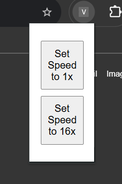

# x16-playback-extension
A barebones chromium extension which toggles video speed between x1 and x16.

You can [load  this as an unpacked extension](https://developer.chrome.com/docs/extensions/get-started/tutorial/hello-world#load-unpacked), or [package it into a .crx file](https://developer.chrome.com/docs/extensions/how-to/distribute/host-on-linux#packaging). 